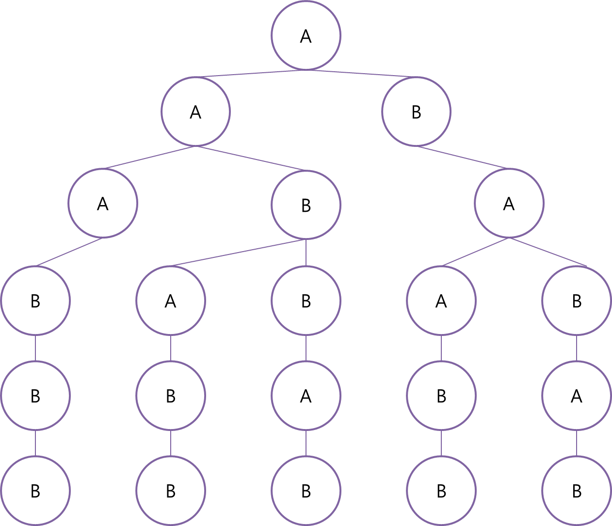

# 스택의 출력 가능한 모든 경우 구하기

## 프로그램 설명  
n=3인 경우 출력 가능한 형태는  
1 2 3   
1 3 2   
2 1 3   
2 3 1   
3 2 1   
5가지   

n=3인 경우   
1, 2, 3 세 개의 숫자에 대하여 3번의 push와 3번의 pop이 발생한다   
(push와 pop의 순서는 상관없으며 일련의 규칙을 따른다.)   
******

이때 push 행동을 알파벳 A, pop 행동을 알파벳 B에 대응시킨다면   
'AAABBB' 또는 'ABABAB'와 같은 문자열을 만들 수 있다.   

'AAABBB'는 먼저 3번 push하고 나중에 pop하므로   
그 결과는 3 2 1 이다.   

'ABABAB'는 push할 때마다 pop하므로   
그 결과는 1 2 3 이다.   
*****

A와 B를 나열할 때 다음과 같은 규칙이 있다.   
* 연속한 A의 개수가 B보다 많거나 같아야한다. (pop이 push보다 많이 일어날 수 없다.)   
* A와 B의 최대 개수는 n개다.   

위와 같은 규칙에 따라 문자를 나열하고자 할 때,   
트리 구조를 사용하면 편리하다.   

   
*****
Tree.java
```java
public void addChild(Node node, int n, int level) {

  int a = countChar(node, 'A');
  int b = countChar(node, 'B');

  if (n > a) {
    Node childNode = new Node("A");
    node.setLeft(childNode);
    childNode.setParent(node);
    this.addChild(childNode, n, level+1);
  }

  if (a > b) {
    Node childNode = new Node("B");
    node.setRight(childNode);
    childNode.setParent(node);
    this.addChild(childNode, n, level+1);
  }

  if (level == n*2-1) {
    lastList.add(node);
  }

}
```
위의 메소드는 어떤 노드에 대하여 조건에 따라   
값이 A 또는 B인 자식 노드를 생성한다.   
재귀 호출 방식으로 모든 노드를 생성하여 트리를 만든다.   
*****
Childly.java
```java
for (int j = 0; j < mask.length(); j++) {

  switch (mask.charAt(j)) {

  case 'A' :
    stack.push(top++);
    break;

  case 'B' :
    System.out.print(stack.pop() + " ");
    break;

  }

}
```
